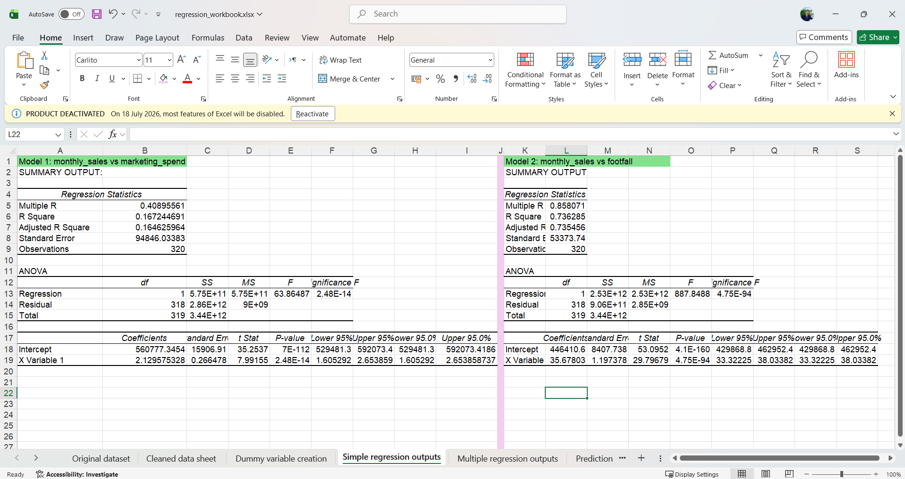

# Retail Chain Sales Regression Analysis

## 1. Business Problem Summary

As a business analyst for the retail chain, the objective of this project is to understand the key factors driving monthly sales performance across our stores. The leadership team is considering several business actions, including:

* Increasing marketing spend
* Improving inventory availability
* Changing discounting strategies
* Reallocating staff
* Prioritizing specific store types or regions

This analysis uses regression modeling to identify which of these factors are most strongly associated with monthly sales to provide data-backed business recommendations.

---

## 2. Dataset Description

The data provided for this analysis includes a primary dataset (`store_performance.csv`) and a supporting dictionary (`data_dictionary.csv`).

### Variable Types

**Numerical Variables**

* `monthly_sales`
* `marketing_spend`
* `footfall`
* `avg_discount_pct`
* `inventory_availability_pct`
* `customer_rating`

**Categorical Variables**

* **`region`**: The geographic location of the store.
* **`store_type`**: The classification or format of the store.

### Data Preparation & Cleaning Strategy

**Variables Requiring Transformation**

* The categorical variables (`region` and `store_type`) cannot be used in their raw text format for regression analysis.
* They will be converted into dummy variables (0 or 1).
* To avoid multicollinearity (the "dummy variable trap"), one category from each variable will be dropped and used as the reference category.

**Variables Not Useful for Regression**

* **`store_id`** (or equivalent identifier): Unique identifiers hold no predictive mathematical value and will be excluded from the regression models.

---

## 3. Dependent and Independent Variables

### Dependent Variable

* **`monthly_sales`**: This is the target variable we are attempting to predict and understand.

### Independent Variables

The factors expected to influence monthly sales are:

* **`marketing_spend`**: Amount invested in marketing.
* **`footfall`**: Customer traffic volume.
* **`avg_discount_pct`**: Average percentage discount offered.
* **`inventory_availability_pct`**: Percentage of inventory consistently available.
* **`customer_rating`**: Average customer satisfaction score.
* **`store_type`**: Store classification used after dummy encoding.

---

## 4. Regression Approach

### Regression Methodology

The project utilized a rigorous, phased statistical approach designed to extract actionable business intelligence from complex retail performance data. This methodology was executed in two distinct stages.

#### Phase I: Simple Linear Regression

Simple linear regression models were developed using `marketing_spend` and `footfall` individually to predict `monthly_sales`. This established the standalone influence of each operational factor and provided a baseline understanding of their relationships with sales.

#### Phase II: Multiple Linear Regression

A multiple regression model was then developed by combining `marketing_spend`, `footfall`, `avg_discount_pct`, and `store_type`.

This approach reduced omitted variable bias and measured the unique contribution of each variable while holding the others constant, providing a more realistic representation of retail operations.

---

## 5. Dummy Variable Approach

Because `store_type` is categorical, it cannot be directly included in a regression model.

### One-Hot Encoding

* One-Hot Encoding was applied to convert `Mall`, `High Street`, `Airport`, and `Residential` into binary dummy variables.

### Avoiding the Dummy Variable Trap

Including every dummy variable creates perfect multicollinearity. Therefore, one category was intentionally omitted.

### Reference Category

`Residential` was selected as the reference category.

The regression coefficients for `Mall`, `High Street`, and `Airport` therefore represent their expected difference in monthly sales compared with Residential stores.

---

## 6. Model Comparison Summary

Three regression models were evaluated.

### Simple Regression 1

**Predictor:** `marketing_spend`

* Positive statistically significant relationship with monthly sales.
* R² = **0.6681**

### Simple Regression 2

**Predictor:** `footfall`

* Stronger standalone predictor than marketing spend.
* R² = **0.7548**

### Multiple Regression (Model 3)

Included:

* `marketing_spend`
* `footfall`
* `avg_discount_pct`
* `store_type`

Performance:

* R² = **0.9721**

The model explains **97.21%** of the variation in monthly sales.

---

## 7. Final Model Selected

The **Multiple Linear Regression Model** was selected as the final model.

### Reasons for Selection

* Highest explanatory power (R² = **97.21%**).
* Controls for omitted variable bias.
* Estimates the independent impact of marketing, footfall, discounts, and store type simultaneously.
* Produces actionable coefficients that enable management to evaluate business scenarios and operational trade-offs.

---

## 8. Business Recommendation

Based on the regression analysis, the following recommendations are proposed:

* Prioritize increasing customer footfall, as it demonstrated the strongest individual relationship with monthly sales.
* Continue investing in marketing while evaluating its effectiveness alongside other operational factors.
* Carefully monitor discount strategies because excessive discounting negatively affects profitability and overall sales performance.
* Consider expanding or investing more heavily in higher-performing store formats, particularly Airport and Mall locations where appropriate.
* Investigate stores with large negative residuals to identify operational issues such as poor customer service, inventory shortages, or local management problems.
* Study stores with large positive residuals to identify best practices that can be replicated across the retail chain.
* Use the multiple regression model as a decision-support tool when planning marketing budgets, store expansion, staffing, and operational improvements.

---

## 9. Assumptions and Limitations

### Statistical Assumptions

The regression analysis assumes:

* A linear relationship between independent variables and monthly sales.
* Independence of store observations.
* Constant variance (homoscedasticity) of residual errors.

### Residual Analysis

Residuals were calculated as:

**Residual = Actual Sales − Predicted Sales**

Key findings include:

* Identification of overperforming stores with positive residuals.
* Identification of underperforming stores with negative residuals.
* Positive residual stores represent potential operational best practices.
* Negative residual stores indicate operational issues not captured by the model.
* The model tends to over-predict sales for high-footfall Mall locations, suggesting a conversion ceiling where many visitors do not make purchases.

### Limitations

* Regression identifies correlation rather than causation.
* External variables such as seasonality, macroeconomic conditions, competition, and supply chain disruptions were not included.
* The model assumes linear relationships and therefore cannot capture diminishing returns from marketing or other nonlinear effects.

---

## 10. Screenshots Included

The following screenshots provide visual evidence of the regression execution, residual analysis, and model comparisons performed during this study.

* **** Figure 01: Statistical summary of the simple regression models.
* **** Figure 02: Statistical summary of the multiple regression model.
* **** Figure 03: Predicted values and residual calculations.
* **** Figure 04: Comparison of all regression models and their R² values.
